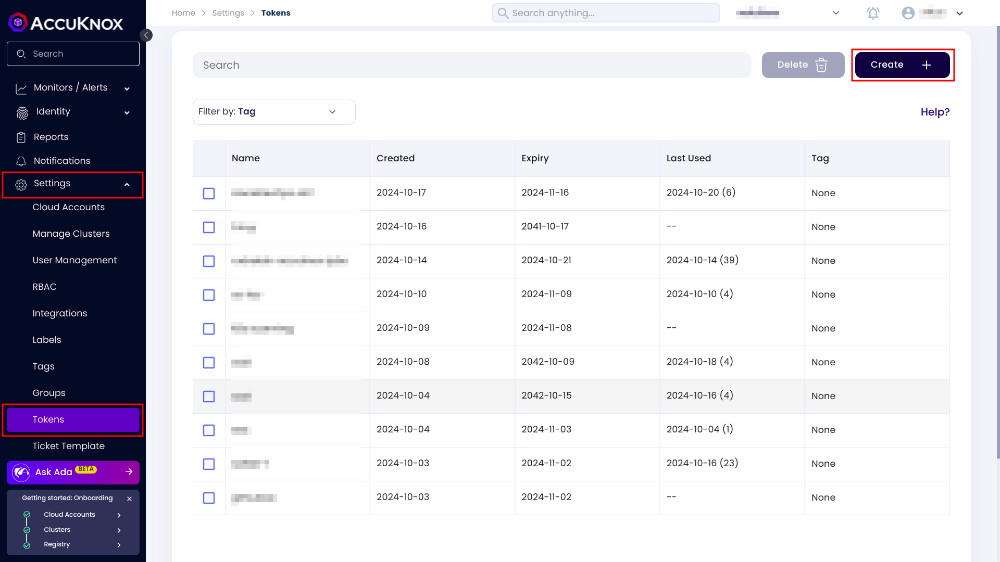
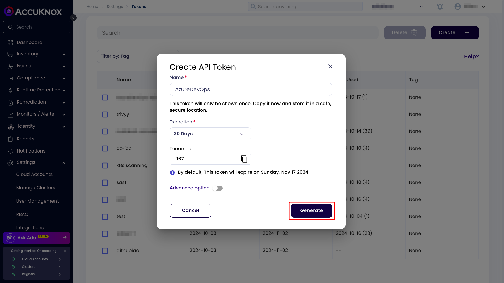
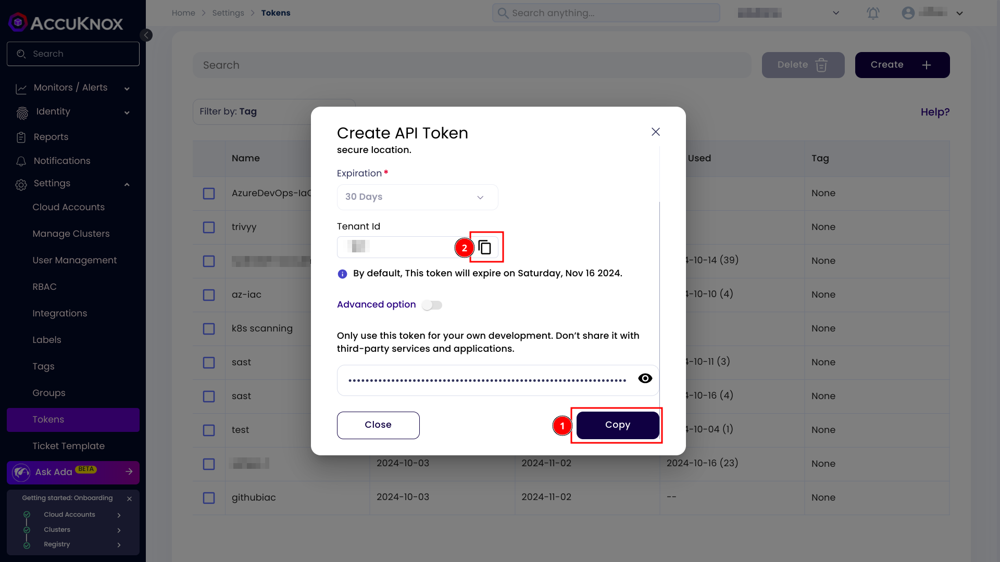

# AccuKnox SAST Azure DevOps extension

[Learn more about AccuKnox](https://www.accuknox.com/)

## Description

This extension runs a Static Application Security Test (SAST) using SonarQube,
then uploads the generated report to the AccuKnox CSPM panel. The extension can be
configured with specific inputs to integrate seamlessly with your DevSecOps pipeline.

## How to use it?

1. **Add the following task into your pipeline:**

```yaml
- task: AccuKnox-SAST@0
  inputs:
    sonarQubeUrl: $(sonarQubeUrl)
    sonarQubeToken: $(sonarQubeToken)
    sonarQubeProjectKey: $(sonarQubeProjectKey)
    accuknoxEndpoint: $(accuknoxEndpoint)
    accuknoxTenantId: $(accuknoxTenantId)
    accuknoxToken: $(accuknoxToken)
    accuknoxLabel: $(accuknoxLabel)
    qualityGate: $(qualityGate)
    skipSonarQubeScan: $(skipSonarQubeScan)
```

2. **Generate the AccuKnox API token:**

For generating the token, open up the AccuKnox UI. And navigate to the settings >
tokens and click on the create button.



<br>
Give your token a name and set the expiry date according to your needs.
Click on the generate button.



<br>
Copy and note down the tenant id and token.



<br>
Store the token as a secret in Azure DevOps.

## Input values

| Input Value | Required | Default Value | Description |
|-------------|----------|---------------|-------------|
| `sonarQubeUrl` | Yes | None | URL of the SonarQube server. eg. `https://sonarqube.example.com` |
| `sonarQubeToken` | Yes | None | SonarQube user token. |
| `sonarQubeProjectKey` | Yes | None | Project key of your SonarQube project. |
| `sonarQubeOrganizationId` | No | None | It is required if your are using SonarQubeCloud. |
| `accuknoxEndpoint` | Yes | None | AccuKnox domain for sending DAST report. eg. `cspm.demo.accuknox.com`, `cspm.accuknox.com` |
| `accuknoxTenantId` | Yes | None | Your AccuKnox tenant ID. You can see your tenant ID while creating an AccuKnox token. |
| `accuknoxToken` | Yes | None | AccuKnox API token. |
| `accuknoxLabel` | Yes | None | AccuKnox label to group similar findings together. |
| `qualityGate` | No | `false` | Quality gate check to fail the build if the quality gate fails. Value should be boolean. |
| `skipSonarQubeScan` | No | `false` | Skip SonarQube scan, for advanced users. Value should be boolean. |

## How it Works

- **SonarQube SAST**: The extension runs a SAST scan on the specified project using SonarQube.
- **AccuKnox Report Generation**: After running the SAST scan it generates a report.
- **Report Upload**: The generated report is uploaded to the AccuKnox CSPM panel for centralized monitoring and insights.
- **Quality Gate Check**: Verifies if the project meets the set quality standards on SonarQube.

## Notes

- Ensure all necessary secrets are securely stored in an Azure DevOps variable group.
- AccuKnox control plane provides a centralized view of all SAST results, enabling detailed security monitoring and analytics.